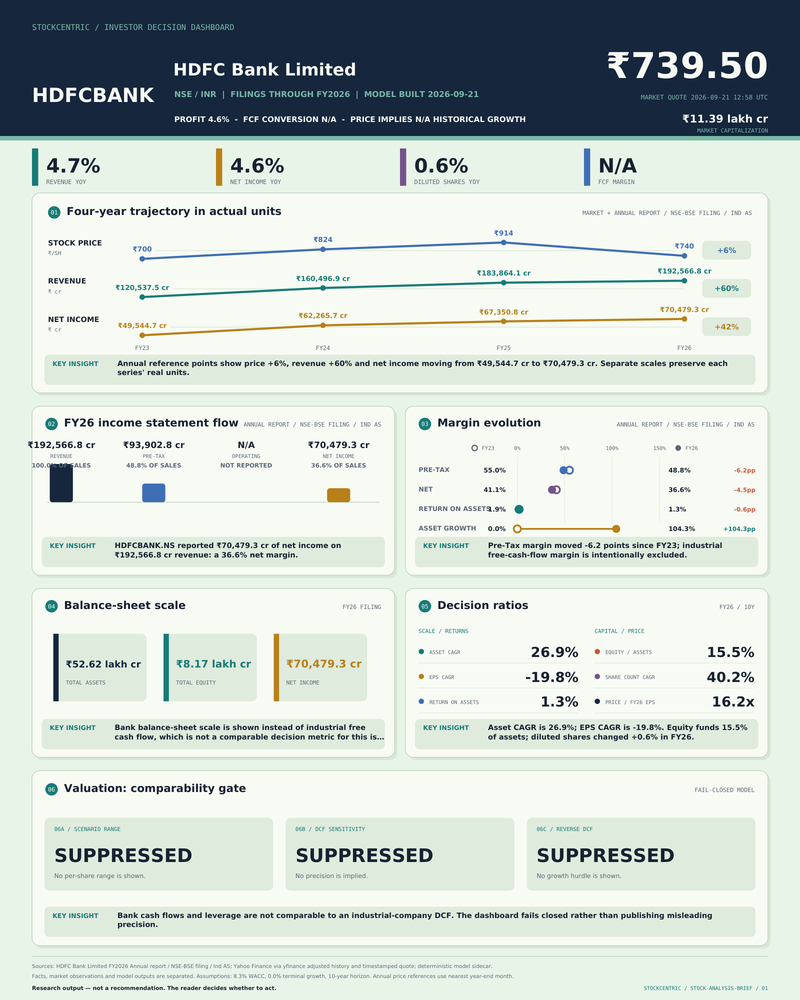

# Fundamental Analysis Brief

Turn a US or Indian stock ticker into a sourced one-page investor fact pattern. The output separates reported facts, market observations and declared valuation assumptions. It does not issue a buy, sell or price-target instruction.

## Example: HDFC Bank



Banks aren't comparable to an industrial-company DCF, so the valuation panel is suppressed rather than filled in with a misleading number. This example is regenerated weekly by [`.github/workflows/refresh-example.yml`](.github/workflows/refresh-example.yml) against live market data — it is never a stale screenshot.

## What it produces

- a 900 × 1125 one-page PDF;
- a 1600 × 2000 PNG infographic;
- the normalized fundamental evidence as JSON;
- the exact saved source bundle and market-history input used for replay.

The page connects eight decision questions: operating scale, revenue and profit trajectory, current income-statement flow, margin direction, cash conversion, decision ratios, scenario valuation and the growth implied by price.

## Supported markets

| Market | Example | Currency | Default listing |
|---|---|---|---|
| United States | `AAPL`, `BRK.B` | USD | provider-resolved US listing |
| India | `RELIANCE`, `RELIANCE.NS`, `500325.BO` | INR | plain symbols default to NSE only with `--market in` |

India output uses rupees and crore-based statement labels. It retains issuer fiscal years and records NSE or BSE resolution. Banks and financial companies receive a sector-aware limited view instead of an industrial-company DCF.

## Run

```bash
python -m venv .venv
. .venv/bin/activate
pip install -e .

fundamental-brief AAPL --market us --out outputs/aapl
fundamental-brief RELIANCE --market in --out outputs/reliance
fundamental-brief 500325.BO --market in --out outputs/reliance-bse
```

For deterministic replay, use the saved bundle:

```bash
fundamental-brief RELIANCE.NS --market in \
  --input-bundle outputs/reliance/source-input.json \
  --out outputs/reliance-replay
```

## Dated-price view

`--as-of YYYY-MM-DD` prices today's filings at the split-adjusted close of a past session. It is **not** a point-in-time reconstruction of what was known on that date — the statements are exactly today's, only the price is dated. The header marks this with a gold "DATED PRICE" banner and a count of how many statement periods postdate the quote.

```bash
fundamental-brief AAPL --market us --as-of 2021-04-09 --out outputs/aapl-2021
```

`--as-of` and `--input-bundle` are mutually exclusive; a bundle saved from a dated run replays as dated with `--input-bundle` alone.

Not for: comparing two dates on one page, computing a return or percentage change against the dated price, or any "would have," "missed," "since then," cheaper/dearer, or undervalued/overvalued framing. Run the tool twice and compare the JSON yourself if you want a then-versus-now view — the page never does that comparison for you.

## Evidence and refusal rules

The default adapter uses Yahoo Finance through `yfinance` for convenient reproducible research inputs. It is not an exchange-grade point-in-time feed. The adapter boundary is deliberately replaceable so licensed data or official filing extractors can feed the same normalized contract.

The tool fails closed when it cannot verify a positive quote, matching currency, four comparable annual periods or consistent ticker/history metadata. Per-share DCF is suppressed for banks, financial issuers, missing diluted shares, missing capital expenditure or non-positive normalized free cash flow.

Valuation inputs are declared research assumptions. US and India use separate market profiles, and the risk-free rate, equity-risk premium, tax rate and terminal growth must be reviewed before decision use.

## Tests

```bash
python -m pytest
```

The suite covers US and India ticker resolution, USD/INR isolation, four- and five-period statements, bank refusal, missing-data failures, deterministic rendering and one-page output dimensions.

Research output — not a recommendation. The reader decides whether to act.
